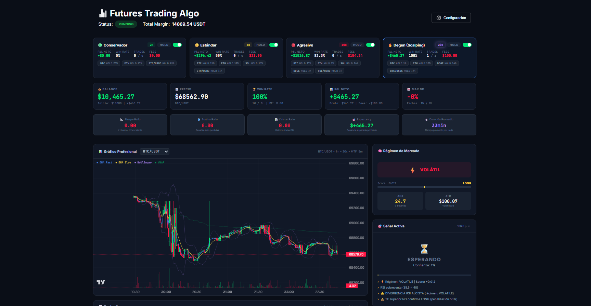

<div align="center">

[](https://git.io/typing-svg)

<br>

<a href="https://portfolio-agustin-olthoff.vercel.app/" target="_blank">
  
</a>
<a href="https://www.linkedin.com/in/agustin-olthoff-961147272/">
  
</a>
<a href="mailto:agusolthoff2002@gmail.com">
  
</a>
<a href="https://tecstorearg.com">
  
</a>
<a href="https://www.instagram.com/tecstore.arg/">
  
</a>

<br><br>


</div>

---

## 🧠 About Me

```javascript
const agustin = {
    role: "Software Developer & Entrepreneur",
    company: "TecStore Argentina — 300K+ followers on Instagram",
    education: "Licenciatura en Sistemas (in progress)",
    focus: ["Business Automation", "E-commerce Infrastructure", "Real-time Systems"],
    philosophy: "I don't just write code — I build the engines that run businesses."
};
```

<br>

<div align="center">
  
  
</div>

<br>

<div align="center">
  
</div>

---

## ⚡ Tech Stack

<div align="center">
  <a href="https://skillicons.dev">
    
  </a>
</div>

---

## 🚀 Featured Projects

<br>

<div align="center">
  <a href="https://github.com/auwus21/cpu-scheduler-sim">
    
  </a>
</div>

<br>

<div align="center">

### 🖥️ [`CPU Scheduler Simulator`](https://github.com/auwus21/cpu-scheduler-sim)


</div>

> A **real-time interactive simulation engine** for CPU scheduling algorithms (FCFS, SJF, Round Robin, Priority). Designed as an educational tool, it features a fully reactive interface for customizing burst times, arrival times, and priorities — complete with a **dynamic Gantt chart** and live performance metrics. Deployed on GitHub Pages.

<br>


---

<br>

<div align="center">
  <a href="https://github.com/auwus21/BotTrading">
    
  </a>
</div>

<br>

<div align="center">

### 📈 [`Institutional Trading Architecture`](https://github.com/auwus21/BotTrading)


</div>

> An **algorithmic trading automation system** with a multi-profile architecture and institutional-grade risk management. The Python backend handles metric calculations and strict risk controls, while the React frontend dashboard provides real-time data flow monitoring and hot-swappable configurations — including **Factory Reset** capabilities without compromising operational uptime.

<br>


---

<br>

<div align="center">
  <a href="./TecStore-CaseStudy.md">
    
  </a>
</div>

<br>

<div align="center">

### 🛒 [`TecStore E-commerce Backoffice`](./TecStore-CaseStudy.md) 🔒


</div>

> A proprietary **B2B operations infrastructure** powering [TecStore Argentina](https://tecstorearg.com/) — one of Argentina's leading tech e-commerce brands with **300K+ followers**. The ecosystem automates financial management (automated accruals, penalty tracking, partner interest calculations), intelligent logistics (multi-node tracking with WhatsApp push notifications), and a **serverless inventory syncer** that routes stock between Shopify & MercadoLibre bypassing WAF restrictions.

<div align="center">

**[📄 Read the Full Technical Case Study →](./TecStore-CaseStudy.md)**

</div>

<br>

---

## 📦 Other Projects

<details>
<summary><b>🔍 Click to expand</b></summary>
<br>

| | Project | Description | Stack |
|:-:|---------|-------------|-------|
| 🧾 | [**WhatsApp Expense Tracker**](https://github.com/auwus21/whatsapp-ticket-bot) | Receives receipts via WhatsApp (text or image), analyzes them with AI (Gemini + OCR), and auto-logs expenses to Google Sheets. | `Node.js` `Gemini` `Tesseract.js` |
| 📦 | [**Employee Order Manager**](https://github.com/auwus21/whatsapp-pedidos-empleados) | Automated WhatsApp notification system that alerts employees about product arrivals and pending balances. | `Node.js` `Google Sheets` `Railway` |
| 🎰 | [**Promo Roulette**](https://github.com/auwus21/ruleta-promocional-react) | Interactive promotional roulette wheel with code validation, animated prizes, and auto-logging to database. | `React` `Vite` `Tailwind` `Framer Motion` |
| 📍 | [**Live Shipment Tracker**](https://github.com/auwus21/tracking-tecstore-md) | Public-facing web app where customers track their orders in real-time against the logistics warehouse. | `React` `Vite` `Framer Motion` |
| ⛓️ | [**Decentralized Marketplace**](https://github.com/TP-Seminario-de-Lenguajes-Rust-2025/marketplacedescentralizado) | Web3 e-commerce platform on blockchain with smart contracts for reputation scoring and user profiles. | `Rust` `Ink!` `Substrate` |
| 🛒 | [**TecStore Website**](https://tecstorearg.com/) | Full e-commerce storefront connected to real-time logistics and inventory microservices. | `Shopify` `Google Apps Script` |

</details>

---

<div align="center">

<br>

*"I don't just write code — I build the infrastructure that makes businesses run."*

<br>

</div>


