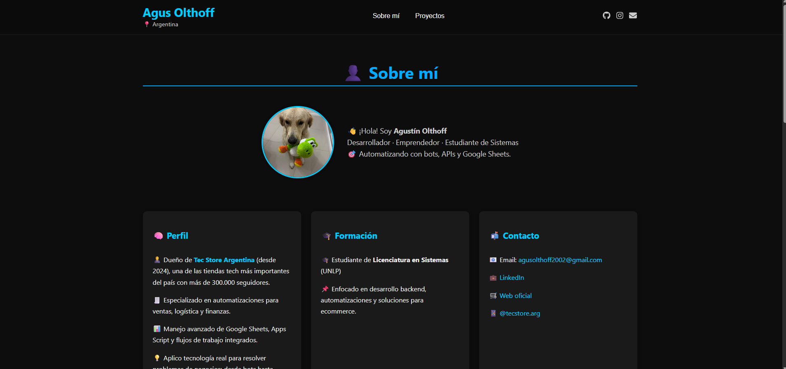

  

  <a href="https://portfolio-agustin-olthoff.vercel.app/" target="_blank"><strong>🌐 portfolio-agustin-olthoff.vercel.app →</strong></a>

<h1 align="center">👋 ¡Hola! Soy Agustín Olthoff</h1>

  <strong>Desarrollador Software · Emprendedor · Estudiante de Sistemas</strong> 
  <em>Diseñando software institucional, arquitecturas escalables y automatizando el mundo real.</em>

  
    
  
  

---

## 🛠️ Tecnologías y Herramientas

  <strong>Frontend:</strong> 
  
  
  

  <strong>Backend & DB:</strong> 
  
  
  

  <strong>Automatización & Otros:</strong> 
  
  
  

---

## 🚀 Proyectos Destacados

 

### 💻 [CPU Scheduler Simulator](https://github.com/auwus21/cpu-scheduler-sim)

  <a href="https://github.com/auwus21/cpu-scheduler-sim">
    <!-- Reemplazar el src por la ruta de tu screenshot real del proyecto (Ej: ./images/screenshot-cpu.png) -->
    
  </a>

Un simulador web interactivo diseñado para entender y visualizar los algoritmos de planificación de CPU del sistema operativo. Desarrollado con **React y Vite**, este proyecto incluye una interfaz visual robusta donde se pueden configurar ráfagas, prioridades y tiempos de llegada simulando tiempo real. *(Desplegado en GitHub Pages)*.

 
 

### 📈 [Trading Bot Institucional](https://github.com/auwus21/BotTrading)

  <a href="https://github.com/auwus21/BotTrading">
    <!-- Reemplazar el src por la ruta de tu screenshot real del proyecto -->
    
  </a>

Bot de automatización de trading con una arquitectura *multi-perfil* y configuraciones de grado institucional. Diseñado en **Python**, incluye un dashboard frontend, integraciones vía APIs para recuperación de métricas y funcionalidades avanzadas de *"Factory Reset"* para gestión estricta del riesgo comercial.

 
 

### 🛒 [Ecosistema Backoffice TecStore](./TecStore-CaseStudy.md) 🔒

  <a href="./TecStore-CaseStudy.md">
    <!-- Reemplazar el src por la ruta de tu screenshot real del proyecto -->
    
  </a>

Suite propietaria de operaciones e-commerce para [TecStore Argentina](https://tecstorearg.com/). *(Software Privado)*.
- **Logística:** Módulo de seguimiento en tiempo real y estados.
- **Finanzas:** Sistema algorítmico de cálculo y asiento automático de "Caja Parada" e intereses para socios.
- **Arquitectura:** Bypass de WAF vía proxy serverless para sincronización masiva de inventario con MercadoLibre, actuando de nexo entre Shopify y Google Sheets.

> 📄 *[Leer el Caso de Estudio Completo sobre la infraestructura TecStore](./TecStore-CaseStudy.md)*

 

---

## 📦 Otros Proyectos

| Proyecto | Descripción | Tecnologías |
|----------|-------------|-------------|
| 🧾 [**Bot de WhatsApp para registrar gastos**](https://github.com/auwus21/whatsapp-ticket-bot) | Recibe tickets por WhatsApp (texto o imagen), los analiza con IA y los carga en Google Sheets. | `whatsapp-web.js`, `Tesseract.js`, `Google Sheets API`, `Gemini`, `Node.js` |
| 📦 [**Gestor de Pedidos para Empleados**](https://github.com/auwus21/whatsapp-pedidos-empleados) | Sistema de consulta y avisos por WhatsApp que avisa automáticamente a empleados cuándo llegan productos o hay saldo pendiente. | `Node.js`, `Google Sheets`, `Railway`, `whatsapp-web.js` |
| 🎰 [**Ruleta React Promocional**](https://github.com/auwus21/ruleta-promocional-react) | Ruleta interactiva para campañas promocionales. Valida código + pedido, muestra premios animados y registra todo en automatizado. | `React`, `Vite`, `Tailwind`, `Framer Motion` |
| 📦 [**Seguimiento de envíos (TecStore)**](https://github.com/auwus21/tracking-tecstore-md) | Web pública para que el cliente consulte el estado de su pedido con el número. Integrado a DB y animado. | `React`, `Vite`, `Framer Motion` |
| 🛒 [**Sitio web TecStore**](https://tecstorearg.com/) | E-commerce desarrollado y conectado a microservicios logísticos en tiempo real. | `Shopify`, `Node.js` |
| 🧾 [**Marketplace Descentralizado**](https://github.com/TP-Seminario-de-Lenguajes-Rust-2025/marketplacedescentralizado) | Plataforma Web3 e-commerce sobre blockchain construida en Rust. Contratos inteligentes de calificación y perfiles. | `Rust`, `Ink!`, `Substrate` |

---

## 🧠 Sobre mí

- 👨‍💼 Actual dueño de [**Tec Store Argentina**](https://www.instagram.com/tecstore.arg/) (desde 2024), una de las tiendas tech líderes de Argentina con **+300.000 seguidores** en Instagram.
- 🧩 Poseo un perfil híbrido: desarrollo soluciones técnicas enfocadas al **escalado del negocio real**.
- 🧾 Especialista en automatización, logística, sincronización cross-plataforma (Shopify / ML) y dashboards de administración B2B/B2C.
- 💡 Estudiante de la Licenciatura en Sistemas.

---

## 📬 Contacto

  
  
  

 

  <em>“No se trata solo de programar, sino de resolver problemas reales y construir infraestructuras que hagan funcionar el motor del negocio.”</em>

